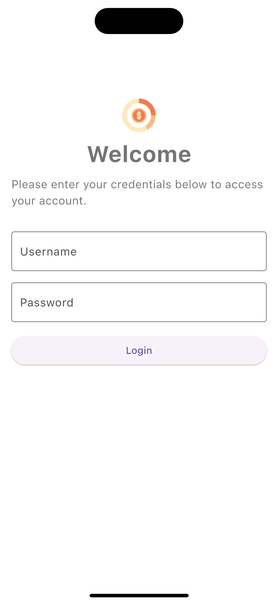
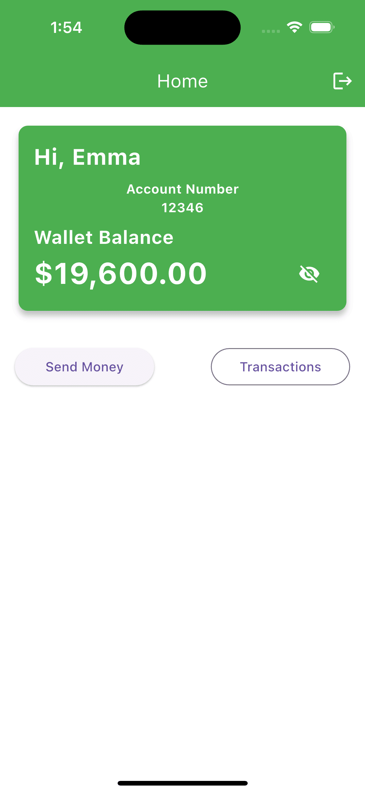
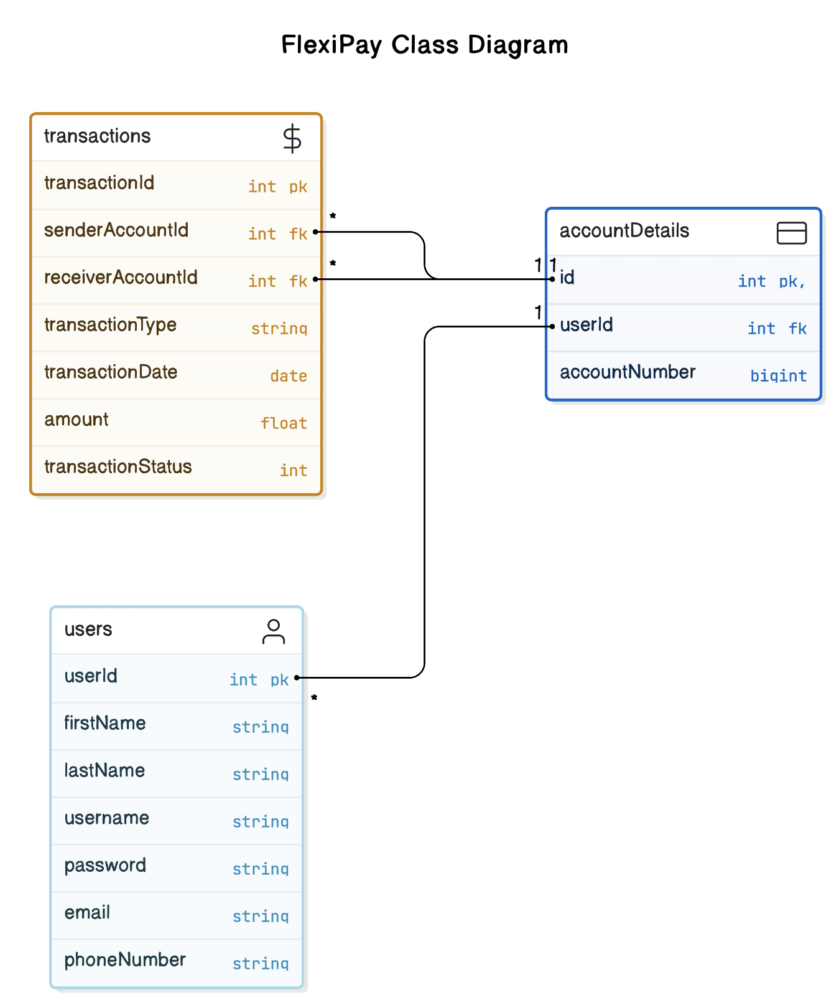

# FlexiPay

FlexiPay is a Flutter application designed to provide a seamless and intuitive way to manage your finances. The app currently features four main screens: Login, Wallet Balance, Send Money, and Transactions. The application is built using the MVVM (Model-View-ViewModel) architecture for a scalable and maintainable codebase.

## Screenshots

<p float="center">
    
    
    
</p>

<p float="center">
    
    
    
</p>

 
*Class Diagram:* The Class Diagram illustrates the core components of the FlexiPay app, detailing user authentication, wallet management, and transaction processes.

 
*Sequence Diagram:* The Sequence Diagram illustrates the interactions for key processes like login, viewing wallet balance, sending money, and viewing transaction history in the FlexiPay app.

## Features

- **Login Screen**: User authentication to ensure secure access.
- **Home Screen**: Displays the user's current wallet balance.
- **Send Money Screen**: Allows users to transfer money easily.
- **Transactions Screen**: Provides a detailed history of transactions.

## Architecture

FlexiPay is built using the MVVM (Model-View-ViewModel) architecture, which facilitates separation of concerns, modularity, and easy testing.

## MVVM Folder Structure

The FlexiPay app follows the MVVM (Model-View-ViewModel) architecture for a scalable and maintainable codebase. Below is the folder structure:

<div>
FlexiPay/ 
├── lib/
│ ├── config/
│ ├── models/ 
│ ├── repositories/ 
│ ├── viewmodels/ 
│ ├── views/ 
│ │ ├── screens/ 
│ │ └── widgets/ 
│ └── main.dart
├── README.md
├── pubspec.yaml
└── ...
</div>

- **config/**: Contains configurable values.
- **models/**: Contains data models. 
- **repositories/**: Contains data access and repository classes. 
- **viewmodels/**: Contains business logic and state management. 
- **views/**: Contains UI components. 
- **screens/**: Contains individual screens for the app. 
- **widgets/**: Contains reusable UI components. This structure ensures a clear separation of concerns, making the app easier to manage and extend.

## Getting Started

To get a local copy up and running follow these simple steps.

### Prerequisites

- Flutter SDK
- Dart
- Any IDE (VS Code, Android Studio)

### Installation

1. Clone the repo:
    ```sh
    git clone https://github.com/rajkumarganesan93/flexipay-mobile-app.git
    ```
2. Navigate to the project directory:
    ```sh
    cd FlexiPay
    ```
3. Install dependencies:
    ```sh
    flutter pub get
    ```

### Running the App

1. Run the app:
    ```sh
    flutter run
    ```

### Test Credentials

Use the following test credentials to log in to the app:

1. Test User **Emma**
- **Username**: `emma`
- **Password**: `any_password`

2. Test User **Jade**
- **Username**: `jade`
- **Password**: `any_password`

## Contact

Project Link: [https://github.com/rajkumarganesan93/flexipay-mobile-app.git](https://github.com/rajkumarganesan93/flexipay-mobile-app.git)

Mock Data Link: [https://github.com/rajkumarganesan93/flexipay-mock-db.git](https://github.com/rajkumarganesan93/flexipay-mock-db.git)
